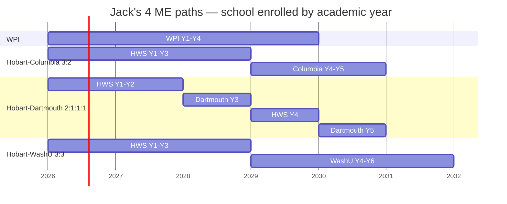

# Semester-by-semester course plans

*Companion to `[README.md](./README.md)` and `[hobart.md](./hobart.md)`. This file maps every term from matriculation to graduation for Jack's four primary Mechanical Engineering paths so he can see, concretely, what his days look like at each starting school. Representative courses only — specific IDs and term placements are subject to each school's flight plan, advisor approval, and year-specific catalogue updates.*

---

## The four paths at a glance

| Path                           | Years | Total courses (approx)                 | Degree(s) earned                                  |
| ------------------------------ | ----- | -------------------------------------- | ------------------------------------------------- |
| 1. WPI                         | 4     | ~45 (15 units × 3)                     | BS ME (ABET)                                      |
| 2a. Hobart → Columbia 3:2      | 5     | ~24 HWS + ~20 Columbia                 | BA physics (HWS) + BS ME (Columbia SEAS, ABET)    |
| 2b. Hobart → Dartmouth 2:1:1:1 | 5     | ~16 HWS + ~18 Dartmouth (3+3 quarters) | BA physics (HWS) + BE ME (Dartmouth Thayer, ABET) |
| 2c. Hobart → WashU 3:3         | 6     | ~24 HWS + ~24 WashU (BS + MS)          | BA physics (HWS) + BS ME + MS ME (WashU McKelvey) |

---

## AP credit baseline (conservative)

Jack's AP exam inventory: Calc AB, Calc BC, Physics C Mechanics, Physics C E&M, CS A (all assumed 4 or 5).

**Primary plan uses this conservative mapping** — credits only where each school publishes a fixed equivalency in writing:

| AP exam        | HWS (conservative)                                 | WPI                   | Columbia SEAS                              | Dartmouth (dual-degree)               |
| -------------- | -------------------------------------------------- | --------------------- | ------------------------------------------ | ------------------------------------- |
| Calc AB        | MATH 130 (Calc I)                                  | MA 1021               | ≤3 pts, conditional on MATH UN1102 ≥ C     | Placement / may require higher course |
| Calc BC        | MATH 131 (Calc II)                                 | MA 1021 + 1022 + 1023 | ≤6 pts, conditional on APMA E2000 ≥ C      | Placement / may require higher course |
| Physics C Mech | **"Department discretion"** — assume **no credit** | PH 1110               | 3 pts, forfeited if PHYS UN1401/1601 taken | Home-school transcript flag           |
| Physics C E&M  | **"Department discretion"** — assume **no credit** | PH 1120               | 3 pts (max 6 combined with Mech)           | Home-school transcript flag           |
| CS A           | CPSC 124                                           | CS 1000               | Exemption from COMS W1004                  | COSC 1 equivalent (verify)            |

**Net conservative effect at HWS:** 3 course credits applied (MATH 130, MATH 131, CPSC 124). Jack takes **PHYS 150 in Fall Y1 and PHYS 160 in Spring Y1** to fulfill the physics major's intro sequence. He starts math at MATH 232 (Multivariable Calc) in Fall Y1.

### Optimistic variant — if Prof. Spector accepts AP Physics C

If the HWS physics department grants Physics C Mech → PHYS 150 and Physics C E&M → PHYS 160, the plan gets materially easier: **PHYS 150 and PHYS 160 drop out of Y1**, and Jack either pulls MATH 204 Linear Algebra + MATH 237 Diff Eq forward from Y2 into Y1 (compressing his Dartmouth-ready timeline by one semester), or uses the slots for a lighter schedule + an extra low-writing goal course earlier. This variant is worth confirming in writing with Prof. Spector before matriculation — **the single most schedule-shaping question Jack can resolve in his admitted-student communications.**

### What AP does NOT count for at HWS

Per the 2024–25 catalogue, **credit-by-exam (including AP) cannot satisfy the eight Educational Goals**, including the six aspirational goals. Jack still needs 5 distinct courses carrying goal attributes for graduation regardless of how many APs transfer.

### Non-AP prior learning — McCallie MAT540 Multivariable Calculus (Dr. Shu Sun)

Jack completed MAT540 Multivariable Calculus at McCallie with Dr. Shu Sun. **Decision: Jack takes MATH 232 at HWS as planned.**

Why: MAT540 was a McCallie-only course, not dual-enrolled with a partner college. HWS credit-by-exam is limited to AP / CLEP / IB (no CLEP for multivariable), and transfer / DE credit both require an official college transcript which doesn't exist. The only remaining mechanism is **placement without credit**, which doesn't save a course slot (Jack still needs 32 HWS courses to graduate) and creates prereq-review risk at all three dual-degree partners (Columbia Combined Plan, Dartmouth Thayer, WashU McKelvey) — each evaluator would need a custom chair's letter arguing that a non-transcripted course satisfies a Multivariable prereq. Not worth the risk to the dual-degree pipeline.

Net effect: MAT540 gives Jack a running start (he's seen the material and can aim for a clean A in MATH 232 Fall Y1), but does not shift any course slots in the plan.

---

## Hobart Y1–Y3 shared core (used by Options 2a, 2b, 2c)

One sequence, built to keep all three Hobart dual-degree forks (Columbia 3:2 / Dartmouth 2:1:1:1 / WashU 3:3) open as long as possible. **Jack does not need to pick a fork before sophomore February** (the Dartmouth application deadline); the Columbia/WashU decisions happen in junior year.

Total: ~24 courses at HWS (4 courses × 2 semesters × 3 years). Jack's Hobart load = 12 physics BA courses + 6 partner-school STEM prereqs + 1 FYS + 4–5 goal courses + 1–2 free electives.

| Term          | Courses                                                                                                                                                      | Notes                                                                                                                                                                                                                                                                                                                                   |
| ------------- | ------------------------------------------------------------------------------------------------------------------------------------------------------------ | --------------------------------------------------------------------------------------------------------------------------------------------------------------------------------------------------------------------------------------------------------------------------------------------------------------------------------------- |
| **Fall Y1**   | <ul><li>**FSEM** (writing-intensive First-Year Seminar)</li><li>**PHYS 150** Intro Physics I</li><li>**MATH 232** Multivariable Calc</li><li>**MUS 930 Chorale** (½ cr, Goal #1 — Partial AP)</li></ul> | FYS likely satisfies Columbia's University Writing via Course Equivalence Form. PHYS 150 lab-heavy. Chorale is the 0-writing ensemble re-entry (see [Recommended goal-course picks](#recommended-goal-course-picks--y1y3-sequencing)). MATH 232 is a re-take of McCallie MAT540 material (see [Non-AP prior learning](#non-ap-prior-learning--mccallie-mat540-multivariable-calculus-dr-shu-sun)). |
| **Spring Y1** | <ul><li>**PHYS 160** Intro Physics II</li><li>**MATH 204** Linear Algebra</li><li>**CHEM 110** Gen Chem + lab</li><li>**ECON 160** Principles of Economics</li><li>**MUS 930 Chorale** (½ cr add-on, pairs with Fall Y1)</li></ul> | ECON 160 satisfies Columbia's ECON W1105 prereq. Per the HWS Educational Goals database it carries only **Partial Quantitative Reasoning** (already covered by the physics major) — so it functions as a free elective toward the 4 courses/semester, **not** a goal course. The 2nd Chorale semester pairs with Fall Y1 to = 1 Partial-AP course-equivalent (Chorale is ½-credit and co-curricular to the 4 academic courses). Linear Algebra is a Dartmouth must-have. |
| **Fall Y2**   | <ul><li>**PHYS 270** Modern Physics</li><li>**MATH 237** Diff Eq</li><li>**CPSC 225** Data Structures (post-AP CS)</li><li>**ANTH 110** Intro Cultural Anthropology (Goal #2 — double-count: Substantial SI + Substantial CD)</li></ul> | Diff Eq is Columbia + WashU required. CPSC 225 upgrades Jack's CS footprint for ME software-heavy work. ANTH 110 in 1 course closes 2 of the 4 live goals (SI + CD); target Maiale's section per RMP. |
| **Spring Y2** | <ul><li>**PHYS 285** Electromagnetic Theory</li><li>**Physics elective #1**</li><li>**DAN 110** Dances of the African Diaspora (Goal #3 — Substantial AP, 0 writing)</li><li>**Free elective OR 2nd chem**</li></ul> | **⚠ Dartmouth 2b application deadline is Feb 1 of Y2.** Jack decides before this term whether 2b is in play — if yes, ensure the Y1–Y2 transcript has all 7 Thayer prereqs done. DAN 110 closes AP substantively (Fall Y1 ensemble becomes insurance). A second chem course is NOT required for any partner; use slot for ME-useful elective (e.g., CPSC 229 Computer Organization). |
| **Fall Y3**   | <ul><li>**PHYS 383** Quantum Mechanics</li><li>**Physics elective #2**</li><li>**PHIL 163** Philosophy of Sport (Goal #4 — Substantial EJ)</li><li>**Free elective**</li></ul> | If 2b Dartmouth admit already in hand, Y3 is spent entirely at Dartmouth — skip to Path 3 table. Otherwise this is the "finalize BA, apply to Columbia + WashU" term. Columbia + WashU apps due Feb Y3. Target a Frost-Arnold PHIL 163 section if available. |
| **Spring Y3** | <ul><li>**PHYS capstone / senior project**</li><li>**Physics elective #3**</li><li>**Goal #5 buffer** (e.g., **MUS 110** Music Theory w/ Lofthouse, or **THTR 160** Stagecraft)</li><li>**Free elective**</li></ul> | Complete HWS physics BA + 5th aspirational goal course. All 4 live goals are already closed by ANTH 110 (SI+CD) + DAN 110 (AP) + PHIL 163 (EJ), so this slot is optional depth / easy-A buffer. This term finishes the BA; Jack transfers to Columbia / WashU in Fall Y4 (or graduates with BA + no partner if everything fell through). |

### Running goal/writing load across the shared core

- **Writing-intensive courses:** 1 (the FSEM). Every other goal course can be picked for low writing.
- **Goal courses:** 5 (one per semester Y1–Y3, matching the 5-course minimum for HWS's 6 aspirational goals). Physics major auto-covers Quantitative Reasoning + Scientific Inquiry, leaving 4 goals × ≥1 course each.
- **Non-STEM total:** ~6 courses (FSEM + 5 goals) out of 24, ~25% of Hobart load. Roughly 1 non-STEM course per semester on average.
- **Rowing / PE:** **HWS has no PE graduation requirement** (2024–25 catalogue, pp. 7–10 — 32 academic courses + FYS + major + goals only). PER 973 Rowing is listed explicitly as a no-credit course. Practical effect: Jack's 4 academic courses/semester stay 100% academic — rowing is pure extracurricular, neither earning nor consuming any of his 24 course slots. Contrast with WPI where varsity rowing converts to PE credit (reclaiming 2 slots); at Hobart there's no PE slot to reclaim because none exists.

### Recommended goal-course picks + Y1–Y3 sequencing

One concrete recommendation per live goal, optimized for Easy-A sentiment and minimum writing. **Full menu, alternates, and RateMyProfessors sentiment data live in [`hws-electives.md`](./hws-electives.md)** — consult it before swapping any pick below.

**⚠ Before locking this sequence:** not every HWS course runs every semester. Before registration each term, Jack must **check the [HWS Course Search](https://www.hws.edu/academics/course-search.aspx) for term offerings** and re-verify goal attributes in PeopleSoft. The semester assignments below assume all courses are offered in the indicated term — if ANTH 110 isn't running Fall Y2, the whole sequence shifts. Have Prof. Spector review the final sequence at each registration window.

| Goal slot (shared-core)      | Recommended course                                                 | Closes which goal(s)                                                 | Writing load       | Why this is the easy-A pick                                                                                                       |
| ---------------------------- | ------------------------------------------------------------------ | -------------------------------------------------------------------- | ------------------ | --------------------------------------------------------------------------------------------------------------------------------- |
| **Goal #1** — Fall Y1        | **MUS 930 Chorale** (½ cr) + **MUS 930 Chorale** (½ cr, Spring Y1) | Partial AP × 2 semesters = 1 course-equivalent of Partial AP         | 0                  | Ensemble = participation grade, no tests or papers. Gentlest music re-entry given Jack's ~3-year gap since HS freshman music.    |
| **Goal #2** — Fall Y2        | **ANTH 110 Intro Cultural Anthropology**                           | **Substantial SI + Substantial CD** (double-count — 2 goals at once) | 2–3 short papers   | Maiale's section is rated 2.0/5 on RMP: "quizzes give full credit for common sense answers, easy readings, clear study guide."    |
| **Goal #3** — Spring Y2      | **DAN 110 Dances of the African Diaspora**                         | **Substantial AP** (closes AP substantively; CD already closed)      | 0                  | Studio-based dance, no writing. 0-writing path to a Substantial AP attribute while the Fall Y1 ensembles stay "insurance" only.   |
| **Goal #4** — Fall Y3        | **PHIL 163 Philosophy of Sport**                                   | Substantial EJ                                                       | 2–3 short papers   | Substantive for a varsity rower (topic is literal sports ethics). Target a Frost-Arnold section if she's teaching it (2.3/5 diff RMP). |
| **Goal #5** — Spring Y3      | **Free / buffer** — e.g., **MUS 110 Intro Music Theory** (Lofthouse) or **THTR 160 Stagecraft** | (all 4 live goals already closed)                       | 0–low              | At this point Jack has 5 distinct goal-applied courses (2 physics + 3 goal courses) and all 4 live goals are done. Use this slot for an easy-A interest pick — MUS 110 with Lofthouse is the strongest RMP Easy-A signal (1.6/5 diff). |

**Total writing across all 5 goal slots:** 4–6 short papers (ANTH 110 + PHIL 163) + 0 writing elsewhere. No long research essays. ANTH 110 is the only sustained-reading course; everything else is participation / project / 0-writing.

**Minimum goal courses needed:** 3 (ANTH 110, DAN 110, PHIL 163) — the Fall Y1 ensemble year and Spring Y3 buffer are optional depth. If Jack wants to reclaim the Fall Y1 slot for another free elective (e.g., DATA 101 for ME-adjacent Python), he can — the 3 goal courses above plus the 2 physics-major goal contributions already satisfy the 5-distinct-courses rule.

**If any of these picks aren't running the expected term** (check Course Search first!), consult [`hws-electives.md`](./hws-electives.md) for backup picks within the same goal category. The most common substitutions:

- **ANTH 110 not offered** → swap to **ECON 248 Poverty and Welfare** (Substantial SI) + **SLA 101+102 Spanish** (Partial CD × 2 = closes CD). Costs 1 extra goal slot.
- **DAN 110 not offered** → swap to 2 more ensemble semesters (closes AP alone via Partial × 2) or **THTR 160 Stagecraft** (Substantial AP, 0 writing). CD already closed by ANTH 110.
- **PHIL 163 not offered** → any of PHIL 130 / 154 / 156 (all Substantial EJ; check RMP for current instructor).

### ⚠ Items to confirm with Prof. Spector before matriculation

1. **Physics C → PHYS 150/160 equivalence** (if yes, see optimistic variant above).
2. **Physics major auto-covers QR + Scientific Inquiry goals** — verify MATH 130/131 and PHYS 150/160 (or whichever major courses Jack takes) currently carry the Quant Reasoning and Scientific Inquiry attributes in PeopleSoft. If a gap exists, Jack would need one of the free-elective Quant/SInq picks to close it.
3. **FSEM → Columbia University Writing equivalency** via Combined Plan Course Equivalence Form. If denied, Jack takes a 100-level rhetoric course (WRRH 100) for Columbia only — adds 1 non-STEM course in 2a.
4. **AP Calc BC credit count** — HWS catalogue phrasing is ambiguous ("2 courses, equiv. MATH 131"). Confirm whether BC gives MATH 130 + 131 combined (2 courses) or MATH 131 only (1 course).
5. **Term offerings + goal attributes for Jack's recommended picks** — re-verify at each registration window that **ANTH 110, DAN 110, PHIL 163**, and the Y1–Y2 Chorale (MUS 930) are (a) actually offered in the proposed semester per [HWS Course Search](https://www.hws.edu/academics/course-search.aspx), (b) still carry the listed goal attribute in PeopleSoft, and (c) are being taught by the instructor whose RMP sentiment informed the easy-A pick (Maiale for ANTH 110, Frost-Arnold for PHIL 163, Lofthouse for the MUS 110 buffer). If any gate fails, fall back to the substitutions listed in the [recommended picks section](#recommended-goal-course-picks--y1y3-sequencing) or the full menu in [`hws-electives.md`](./hws-electives.md).

---

## Path 1 — WPI Mechanical Engineering BS (4 years)

**Structure:** 4 academic years × 4 seven-week terms (A = Aug–Oct, B = Oct–Dec, C = Jan–Mar, D = Mar–May). Students take **3 courses per term typically**, for 48 course-term slots across the degree (15 units × 3 courses/unit ≈ 45 courses). Each WPI course = 1/3 unit; 15 units total required for the ME BS.

**AP credits applied:** MA 1021 (AB), MA 1021 + 1022 + 1023 (BC — subsumes AB), PH 1110 + PH 1120 (Physics C Mech + E&M — WPI's published AP chart grants these; no department-discretion step), CS 1000 (CS A). **Jack arrives with ~6 course-equivalents done.** Remaining: ~39 courses across 16 terms ≈ 2.5 courses/term average (very tractable; standard load is 3/term).

| Term     | Representative courses | Bucket                    | Notes                                                                                                |
| -------- | ---------------------- | ------------------------- | ---------------------------------------------------------------------------------------------------- |
| **Y1 A** | <ul><li>**MA 1024** Calc IV</li><li>**CH 1010** Gen Chem</li><li>**HU** Inquiry Seminar (themed cluster start)</li></ul> | 2 STEM · 1 HUA | HU cluster topic choice shapes Y2–Y3 HUA picks. |
| **Y1 B** | <ul><li>**CH 1020** Gen Chem II</li><li>**ES 2501** Statics</li><li>**HU #2**</li></ul> | 2 STEM · 1 HUA | |
| **Y1 C** | <ul><li>**MA 2051** Diff Eq</li><li>**ES 2502** Stress Analysis</li><li>**Free elective** (e.g., CS 2102 Object-Oriented Design)</li></ul> | 3 STEM | Varsity rowing covers PE (confirmed on WPI campus tour) — no standalone PE course needed. |
| **Y1 D** | <ul><li>**MA 2071** Linear Algebra</li><li>**ES 2503** Dynamics</li><li>**HU #3**</li></ul> | 2 STEM · 1 HUA | |
| **Y2 A** | <ul><li>**ES 3001** Thermodynamics</li><li>**ME 1800** Materials/Manufacturing</li><li>**HU #4**</li></ul> | 2 STEM · 1 HUA | |
| **Y2 B** | <ul><li>**ES 3003** Fluid Mechanics</li><li>**ECE 2010** Intro Electrical Eng</li><li>**HU #5** (cluster capstone)</li></ul> | 2 STEM · 1 HUA | |
| **Y2 C** | <ul><li>**ES 3004** Heat Transfer</li><li>**ME 2300** Adv Engr Mech</li><li>**HUA Inquiry Practicum**</li></ul> | 2 STEM · 1 HUA | Completes the 6-course HUA requirement. |
| **Y2 D** | <ul><li>**ME 3901** Engineering Experimentation</li><li>**ME 2612** Mechanical Components</li><li>**Soc Sci #1** (ECON 1110 or similar)</li></ul> | 2 STEM · 1 SocSci | |
| **Y3 A** | <ul><li>**IQP #1** (Interactive Qualifying Project, 3-term social-impact research project)</li></ul> | 1 IQP | IQP = 3 courses across 3 terms. Social-science framing, group-based; writing load varies by advisor. |
| **Y3 B** | <ul><li>**IQP #2**</li><li>**ME 4320** Advanced Engineering Design</li></ul> | 1 IQP · 1 STEM | |
| **Y3 C** | <ul><li>**IQP #3**</li><li>**ME 4512** Vibrations</li></ul> | 1 IQP · 1 STEM | IQP complete. |
| **Y3 D** | <ul><li>**ME 3321** Thermal-Fluid Systems</li><li>**ME elective #1**</li><li>**Free elective** (e.g., MA 2621 Probability)</li></ul> | 3 STEM | Varsity rowing continues to satisfy PE; slot repurposed for ME-adjacent technical depth. |
| **Y4 A** | <ul><li>**MQP #1** (Major Qualifying Project, 3-term senior design)</li><li>**ME elective #2**</li><li>**Soc Sci #2**</li></ul> | 1 MQP · 1 STEM · 1 SocSci | MQP = major capstone, often industry-sponsored. |
| **Y4 B** | <ul><li>**MQP #2**</li><li>**ME elective #3**</li><li>**Free elective**</li></ul> | 1 MQP · 2 STEM | |
| **Y4 C** | <ul><li>**MQP #3**</li><li>**ME elective #4**</li><li>**Free elective**</li></ul> | 1 MQP · 2 STEM | MQP complete. |
| **Y4 D** | <ul><li>**ME elective #5**</li><li>**Free elective**</li><li>**Free elective**</li></ul> | 1 STEM · 2 Free | Buffer term; often lighter. |

**Running totals:** ~30 STEM/ME/project courses, 6 HUA, 2 Soc Sci, ~6 free electives = ~45 courses. The 2 PE slots that would otherwise be required are covered by varsity rowing participation (WPI grants PE credit for each varsity sport season), leaving those slots as free electives for extra ME/technical depth. Writing-intensive exposure concentrates in Inquiry Seminar + IQP writeup + MQP thesis. The 5-course HUA cluster carries moderate writing depending on topic selection.

### WPI electives (low-writing picks)

- **HUA themed cluster** — pick History of Science, History of Technology, or Philosophy of Science. These clusters emphasize analytical reading and short reaction papers over long writing projects. Alternative: Music (non-performance, theory/listening).
- **Social Science** — ECON 1110 Principles of Microeconomics (problem sets + exams, minimal prose). Avoid PSY 1400 or SOC courses with large essay components.
- **ME electives** — ME 4508 Introduction to Finite Element Analysis, ME 4513 Measurement & Instrumentation, ME 4717 Mechatronics, ME 4322 Thermal Systems Design. All zero-writing, problem-set / lab based.
- **Free electives** — ECE 2029 Digital Circuits, CS 2102 Object-Oriented Design, MA 2621 Probability for Applications. Same style.

### ⚠ Items to confirm with WPI

1. **Exact ME flight plan for incoming 2026 cohort** — WPI updates the recommended sequence annually. Jack's actual registration will follow the current Department of Mechanical Engineering flight plan, which may reshuffle specific term placements.
2. **AP credit finalization** — WPI grants credit on transcript receipt; confirm Calc BC + Physics C show up as MA 1021–1023 + PH 1110 + 1120 (not just generic WPI credit) during orientation.
3. **Varsity rowing → PE credit** — confirmed on campus tour (Apr 2026) that varsity sports count toward WPI's PE requirement. Operational detail to confirm at orientation with the registrar and crew coach: exactly how Fall + Spring rowing seasons get logged on the transcript so both PE slots are filled without separate course registration.
4. **IQP site/topic preference** — Jack can shape the writing load significantly by picking an IQP site with a technical framing (e.g., engineering-focused field sites) rather than a humanities-heavy framing.

---

## Path 2a — Hobart → Columbia SEAS ME BS (3:2, 5 years)

**Y1–Y3 at Hobart:** see shared core table above.

**Y4–Y5 at Columbia** (standard semesters, 4–5 courses per term, ~9 courses/year, ~18 courses total at Columbia).

**Columbia ME prereqs satisfied at Hobart:** Calc I–III (AP + MATH 232), Linear Algebra (MATH 204), Diff Eq (MATH 237), Physics I–II (PHYS 150 + 160), Gen Chem + lab (CHEM 110), CS (AP + CPSC 225), Econ (ECON 160), University Writing (FSEM, pending equivalence). All 27 non-technical credits satisfied by the HWS BA structure (physics major + 5 goal courses + FSEM + electives).

| Term          | Representative courses | Bucket            | Notes                                                           |
| ------------- | ---------------------- | ----------------- | --------------------------------------------------------------- |
| **Fall Y4**   | <ul><li>**MECE E3301** Mechanics of Fluids</li><li>**MECE E3100** Mechanics of Solids</li><li>**APMA E3101** Applied Math I</li><li>**MECE E3420** Heat Transfer</li><li>**Nontech elective #1**</li></ul> | 4 ME/STEM · 1 HUM | First Columbia term. First rowing season on Columbia LW. |
| **Spring Y4** | <ul><li>**MECE E3311** Thermodynamics</li><li>**MECE E3610** Electromechanical Systems Lab</li><li>**MECE E4614** Machine Element Design</li><li>**ME elective #1**</li><li>**Nontech elective #2**</li></ul> | 4 ME/STEM · 1 HUM | Heaviest term. |
| **Fall Y5**   | <ul><li>**MECE E4100** Mech Eng Senior Design I</li><li>**MECE E4520** Data Science for Mech Engrs</li><li>**ME elective #2**</li><li>**ME elective #3**</li><li>**Nontech elective #3**</li></ul> | 4 ME/STEM · 1 HUM | Y5 Jack is a graduate-standing student — Ivy rowing ineligible. |
| **Spring Y5** | <ul><li>**MECE E4101** Senior Design II (capstone)</li><li>**ME elective #4**</li><li>**ME elective #5**</li><li>**Nontech elective #4**</li></ul> | 3 ME/STEM · 1 HUM | Capstone graduation term. |

**Non-STEM load at Columbia:** 3–4 nontech electives across Y4–Y5 (assuming Combined Plan students follow the 27-pt nontech rule without the Columbia Core humanities requirement — see flag below). Zero writing-intensive requirement if Jack picks problem-set-style nontech electives.

### Columbia Y4–Y5 low-writing nontech picks

Columbia's [approved nontech elective list](https://bulletin.engineering.columbia.edu/b-elective-nontechnical-courses) is deep. Prefer:

- **ECON W3211 Intermediate Microeconomics** · **ECON W3213 Intermediate Macroeconomics** — problem sets, minimal writing; Jack already has ECON 1105 from HWS.
- **COMS W3203 Discrete Math** — if approved as nontech for ME; pure problem sets.
- **HIST W3930 History of Technology** or **HIST W3925 Science in American History** — reading-heavy but short response papers.
- **MUSI V3321 Music Theory I** — notation and ear-training, not essay-based.
- **PSYC W1010 Mind, Brain, Behavior** — intro cog-sci, exam-based.

**Avoid** Columbia Core Curriculum courses (Lit Hum, Contemporary Civilization, Art Hum, University Writing) unless explicitly required — these are the writing-heaviest courses on campus. Combined Plan students are believed to be exempt from the full Core; see confirm box.

### ⚠ Items to confirm with Columbia Combined Plan office

1. **27-pt nontech waiver** — the ME bulletin footnote suggests Combined Plan students may have a reduced/waived nontech requirement vs. direct SEAS admits. Clarify the exact nontech count required at Columbia Y4–Y5 for a 3:2 entrant who already has a full HWS BA.
2. **Course Equivalence Form submissions** — walk through HWS ECON 160, FSEM, and the STEM prereqs with the Combined Plan adviser to ensure each is mapped on Jack's file before he matriculates.
3. **Columbia AP forfeiture rules** — confirm Jack's HWS-transcribed calc/physics do NOT trigger the "credit forfeited if PHYS UN1401/1601 taken" rule. (They shouldn't, because he took them at HWS, not Columbia — but worth confirming.)
4. **ME electives picked for low writing** — ME 4000-level electives are all technical; but confirm with an ME adviser which specific electives have the lowest lab-report burden (heat transfer labs tend to be report-heavy; theory-only electives less so).

---

## Path 2b — Hobart → Dartmouth Thayer ME BE (2:1:1:1, 5 years)

**Y1–Y2 at Hobart:** the shared core above, compressed into 2 years instead of 3. Jack front-loads all STEM prereqs + FSEM + 2 goal courses, deferring remaining goals and physics electives to Y4. **Feb 1 of Y2 is the hard Dartmouth application deadline.**

**Dartmouth calendar:** 3 quarters per academic year (Fall, Winter, Spring), **3 courses per quarter typically.** Y3 = 9 courses at Dartmouth; Y5 = 9 courses at Dartmouth. Total = 18 Dartmouth courses.

**Thayer ME prereqs (dual-degree page):** Calc 1, 2, Multivariable, Physics 1, 2, Gen Chem, CS — all 7 covered via HWS Y1–Y2 (plus Linear Algebra for ME track).

### HWS Y1–Y2 (compressed shared core)

| Term          | Courses | Notes |
| ------------- | ------- | ----- |
| **Fall Y1**   | <ul><li>**FSEM**</li><li>**PHYS 150** Intro Physics I</li><li>**MATH 232** Multivariable Calc</li><li>**MUS 930 Chorale** (½ cr, Goal #1 — Partial AP)</li></ul> | Same as shared core. |
| **Spring Y1** | <ul><li>**PHYS 160** Intro Physics II</li><li>**MATH 204** Linear Algebra</li><li>**CHEM 110** Gen Chem + lab</li><li>**ECON 160** (Columbia prereq only — NOT a goal course per HWS Ed Goals DB)</li><li>**MUS 930 Chorale** (½ cr add-on, pairs with Fall Y1)</li></ul> | All Thayer STEM prereqs except CS now in progress. |
| **Fall Y2**   | <ul><li>**PHYS 270** Modern Physics</li><li>**MATH 237** Diff Eq</li><li>**CPSC 225** Data Structures (post-AP CS)</li><li>**ANTH 110** Intro Cultural Anthropology (Goal #2 — double-counts SI + CD, Substantial each)</li></ul> | Transcript ready for Thayer Feb 1 application. |
| **Spring Y2** | <ul><li>**PHYS 285** E&M Theory</li><li>**Physics elective #1**</li><li>**PHIL 163** Philosophy of Sport (Goal #3 — Substantial EJ)</li><li>**Free elective**</li></ul> | Jack submits Thayer application in this window; decision by ~April. |

### Dartmouth Y3 (junior year at Thayer)

Thayer's ME-track Y3 is 3 engineering courses per quarter (the Thayer sequence) plus room for ~3 non-engineering courses spread across the 3 quarters. **Dartmouth explicitly structures Y3 so the non-ENGS slots count back toward the home-school BA** — this is the mechanism by which 2b absorbs 3 of Jack's HWS goal courses at Dartmouth.

| Quarter       | Courses | Bucket                     | Notes                                                                             |
| ------------- | ------- | -------------------------- | --------------------------------------------------------------------------------- |
| **Fall Y3**   | <ul><li>**ENGS 21** Intro to Engineering</li><li>**ENGS 22** Systems</li><li>**Non-ENGS #1** (Math elective, e.g., MATH 23 Diff Eq II or Probability)</li></ul> | 2 ENGS · 1 non-ENGS (STEM) | Rowing season = Dartmouth LW (only Ivy LW season in this path). |
| **Winter Y3** | <ul><li>**ENGS 23** Distributed Systems and Fields</li><li>**ENGS 33** Solid Mechanics (ME)</li><li>**Non-ENGS #2** (PHYS elective or ECON elective)</li></ul> | 2 ENGS · 1 non-ENGS (STEM) | ENGS 33 is a core ME concentration course. |
| **Spring Y3** | <ul><li>**ENGS 34** Fluid Mechanics (ME)</li><li>**ENGS 25** Modeling & Design</li><li>**Non-ENGS #3** (COSC elective or additional MATH)</li></ul> | 2 ENGS · 1 non-ENGS (STEM) | ENGS 34 requires ENGS 23. 3 non-ENGS slots all STEM-adjacent = zero writing load. |

**Non-ENGS slots transfer:** Up to 3 courses from Y3 Dartmouth transfer back to HWS to count toward HWS aspirational goals (Quantitative Reasoning: covered by physics major already, so these become goal #4/#5 candidates OR free-elective-buffer).

### HWS Y4 (senior year, finish the physics BA)

| Term          | Courses | Notes |
| ------------- | ------- | ----- |
| **Fall Y4**   | <ul><li>**PHYS 383** Quantum Mechanics</li><li>**Physics elective #2**</li><li>**DAN 110** Dances of the African Diaspora (Goal #4 — Substantial AP, 0 writing)</li><li>**Free elective**</li></ul> | Final year of HWS rowing (openweight, burns 4th/final IRA season). |
| **Spring Y4** | <ul><li>**PHYS capstone / senior project**</li><li>**Physics elective #3**</li><li>**Goal #5 buffer** (e.g., **MUS 110** Music Theory w/ Lofthouse, or **THTR 160** Stagecraft)</li><li>**Free elective**</li></ul> | Completes HWS physics BA. BA conferred at end of Y4 (may defer to Y5 alongside BE). |

### Dartmouth Y5 (BE year)

The BE year is pure engineering: 3 quarters × 3 courses = 9 courses. Thayer BE structure: ENGS 89–90 ME capstone (2 terms), ENGS 91–93 Applied Math sequence (3 terms, 1 per quarter), plus ~4 ME concentration / design electives.

| Quarter       | Courses | Bucket | Notes                                         |
| ------------- | ------- | ------ | --------------------------------------------- |
| **Fall Y5**   | <ul><li>**ENGS 89** Engineering Design Methodology (capstone I)</li><li>**ENGS 91** Numerical Methods</li><li>**ENGS 76** Machine Engineering (ME concentration)</li></ul> | 3 STEM | Y5 graduate standing = Ivy rowing ineligible. |
| **Winter Y5** | <ul><li>**ENGS 90** Engineering Design Project (capstone II)</li><li>**ENGS 92** Fourier + Complex Analysis</li><li>**ENGS 71** Structural Analysis</li></ul> | 3 STEM | |
| **Spring Y5** | <ul><li>**ENGS 93** Statistical Methods</li><li>**ENGS 75** Product Design + Manufacturing</li><li>**ME elective**</li></ul> | 3 STEM | BE conferred at end of Y5. |

### Y3 Dartmouth low-writing non-ENGS picks

- **MATH 23 Differential Equations II** — problem sets only.
- **MATH 20 Probability** · **MATH 50 Linear Algebra II** — pure math, no writing.
- **PHYS 50 Methods of Theoretical Physics** — extension of HWS physics.
- **ECON 1 / 2 / 10 Principles / Micro / Macro** — problem sets + exams.
- **COSC 10 / 30 / 50** — CS electives, lab-based.

### Y5 Dartmouth ME concentration elective picks

Thayer requires 3–4 courses forming a "concentration." ME-track options (low writing, problem-set / project based):

- **ENGS 71 Structural Analysis** (solids track)
- **ENGS 76 Machine Engineering** (design track)
- **ENGS 75 Product Design + Manufacturing** (design track)
- **ENGS 168 Optimization**
- **ENGS 147 Advanced Heat Transfer**

### ⚠ Items to confirm with Dartmouth Thayer + Prof. Spector

1. **AP credit treatment for prereqs** — Thayer's dual-degree page says home-institution AP/IB is honored, but earlier guidance said AP/IB do not count toward prereqs. Clarify: do Jack's AP-transcribed Calc + CS count, or does he need to retake at HWS for a letter grade? **If the latter, Y1–Y2 at HWS shifts significantly** (CPSC 225 moves to CPSC 124 actually taken, additional math slot needed).
2. **Non-ENGS Y3 course attribute transfer** — confirm with Thayer registrar AND Prof. Spector that MATH 23, PHYS 50, ECON 1, etc. taken at Dartmouth carry HWS goal attributes when transferred back. The 2:1:1:1 cost advantage and the "Y3 absorbs goal courses" narrative both depend on this.
3. **Y5 writing requirement** — Dartmouth undergrads have a Writing 5 requirement. Dual-degree BE students typically don't take it (they satisfy writing via home-school FSEM). Confirm this still holds for Thayer 2:1:1:1 students in the current handbook.
4. **ME-track-specific ENGS 24–28 and ENGS 30–37 picks** — the Thayer ME concentration has a specific subset of required + recommended electives; get the current ME track sheet from Thayer academic advising.

---

## Path 2c — Hobart → WashU McKelvey 3:3 (6 years)

**⚠ Credential clarification needed:** McKelvey's [dual-degree admissions page](https://engineering.washu.edu/academics/dual-degree-program/index.html) describes "three years at WashU with 50% tuition" but does not clearly delineate whether the three years deliver a BS + MS (what `background.md` and `README.md` assume) or something else. **Confirm with McKelvey admissions** whether:

- Y4 = BS junior year, Y5 = BS senior year, Y6 = MS year (conventional 3:3 framing), OR
- Y4–Y6 are all undergrad junior/senior/senior (giving only the BS), with MS as a separate add-on.

This plan assumes the first interpretation (BS + MS in 3 years).

**Y1–Y3 at Hobart:** see shared core table above. WashU's prereqs align well with the shared core — Calc through multivariable + Diff Eq, Linear Algebra (recommended), Physics 1–2 + **1 upper-division physics** (ME-specific), Gen Chem + lab, CS, 15 SH humanities / social science.

**⚠ One WashU-specific addition:** ME-specific "1 semester upper-division physics beyond the required year sequence." Jack's HWS physics major includes PHYS 270 (Modern Physics) and PHYS 285 (E&M Theory) which should satisfy this; confirm with WashU evaluator.

### WashU Y4 (undergrad junior year)

| Term          | Representative courses | Bucket         | Notes                                                                |
| ------------- | ---------------------- | -------------- | -------------------------------------------------------------------- |
| **Fall Y4**   | <ul><li>**MEMS 2500** Dynamics</li><li>**MEMS 2610** Mechanical Components</li><li>**ESE 3260** Linear Systems</li><li>**1 HUM elective**</li><li>**WashU rowing** (final ACRA season, co-curricular)</li></ul> | 3 STEM · 1 HUM | ACRA season Y4 = Jack's 4th and final (see README eligibility note). |
| **Spring Y4** | <ul><li>**MEMS 3411** Thermodynamics</li><li>**MEMS 3420** Fluids</li><li>**MEMS 3610** Mech Components Lab</li><li>**1 HUM elective**</li></ul> | 3 STEM · 1 HUM | |

### WashU Y5 (undergrad senior year)

| Term          | Representative courses | Bucket          | Notes                   |
| ------------- | ---------------------- | --------------- | ----------------------- |
| **Fall Y5**   | <ul><li>**MEMS 4500** Heat Transfer</li><li>**MEMS 4510** Senior Design I</li><li>**ME elective #1**</li><li>**1 HUM elective**</li></ul> | 3 STEM · 1 HUM | BS conferred end of Y5. |
| **Spring Y5** | <ul><li>**MEMS 4511** Senior Design II (capstone)</li><li>**ME elective #2**</li><li>**ME elective #3**</li><li>**1 free elective**</li></ul> | 3 STEM · 1 Free | |

### WashU Y6 (MS year)

MS track options: coursework-only (10 courses / 30 credits) or thesis (24 credits + thesis). The 3:3 structure typically fits into coursework-only across 2 semesters.

| Term          | Representative courses | Bucket        | Notes                                 |
| ------------- | ---------------------- | ------------- | ------------------------------------- |
| **Fall Y6**   | <ul><li>**MEMS 5XXX** Advanced Mechanics</li><li>**MEMS 5XXX** Advanced Fluid Mechanics</li><li>**MS elective #1**</li><li>**MS elective #2**</li><li>**MS elective #3**</li></ul> | 5 STEM (grad) | Pure engineering. No HUM requirement. |
| **Spring Y6** | <ul><li>**MEMS 5XXX** Advanced Heat Transfer</li><li>**MS elective #4**</li><li>**MS elective #5**</li><li>**MS elective #6**</li><li>**MS thesis or capstone**</li></ul> | 5 STEM (grad) | MS conferred end of Y6. |

### WashU elective picks (low-writing)

- **Humanities (15 SH at WashU Y4–Y5):** History of Science, History of Technology, Engineering Ethics (often offered by McKelvey — likely problem-set / case-study format, not prose-heavy), Economics Principles. Avoid literature/philosophy seminars.
- **ME electives** (undergrad and grad): MEMS 4410 Vibrations, MEMS 4420 Robotics, MEMS 4500 Control Systems, MEMS 4700 Automotive Engineering — all problem-set / lab / project.
- **MS electives:** most McKelvey grad ME courses are lecture + problem-set + small project. Pick based on career interest (energy systems, robotics, aerospace, biomech) rather than writing-load (all are low-writing).

### ⚠ Items to confirm with WashU

1. **3:3 credential mechanics** — BS + MS confirmed? Or something else?
2. **HWS physics major → WashU upper-division-physics requirement** — confirm PHYS 270 + PHYS 285 from HWS satisfy WashU's "1 upper-div physics beyond year sequence."
3. **15 SH humanities distribution at WashU** — does the HWS BA credit transfer toward this count, reducing how much Jack takes at WashU?
4. **Graduate Affiliation Scholarship 50% discount renewal** — verify it applies to all 3 years at WashU (Y4 + Y5 undergrad + Y6 MS), not just the MS year. `background.md` assumes all 3.

---

## Consolidated low-writing elective picks

Summary table across all paths, grouped by school:

| School                            | Where the slack is                                  | Top picks (low writing, high STEM-adjacency)                                                                                                                                                                                      |
| --------------------------------- | --------------------------------------------------- | --------------------------------------------------------------------------------------------------------------------------------------------------------------------------------------------------------------------------------- |
| **HWS** (all 3 Hobart paths)      | 5 aspirational goal courses + free electives        | **ANTH 110** (Substantial SI + CD double-count) · **DAN 110** (Substantial AP + CD double-count) · **PHIL 163 Philosophy of Sport** (Substantial EJ) · Music ensembles (Partial AP, 0 writing) · ECON 160 and MUS 110 as free-elective fillers (neither carries a live-goal attribute) — see [recommended goal-course picks](#recommended-goal-course-picks--y1y3-sequencing) inline below, and [`hws-electives.md`](./hws-electives.md) for the full menu + RMP sentiment |
| **WPI**                           | 6 HUA + 2 Soc Sci + ME electives + free             | History of Tech / Philosophy of Sci themed cluster · ECON 1110 · ME 4717 Mechatronics · MA 2621 Probability · CS 2102                                                                                                             |
| **Columbia Y4–Y5**                | ~4 nontech electives (if not waived) + ME electives | ECON W3211 / W3213 · HIST W3930 History of Tech · MUSI V3321 Music Theory · PSYC W1010 Cog Sci · **avoid Core courses**                                                                                                           |
| **Dartmouth Y3 non-ENGS**         | 3 courses                                           | MATH 23 Diff Eq II · MATH 20 Probability · PHYS 50 Theoretical Methods · ECON 1 / 10 · COSC 30 (all pure STEM, no writing)                                                                                                        |
| **Dartmouth Y5 BE concentration** | 3–4 ME concentration electives                      | ENGS 71 Structural Analysis · ENGS 76 Machine Eng · ENGS 75 Product Design · ENGS 168 Optimization                                                                                                                                |
| **WashU**                         | 15 SH humanities + ME electives + MS electives      | History of Sci/Tech · Engineering Ethics · ECON 1011 · MEMS 4420 Robotics · grad MEMS electives (all problem-set)                                                                                                                 |

**Writing-heavy courses Jack should actively avoid** (where optional):

- HWS WRRH 100 rhetoric courses (only take if FSEM advisor requires)
- WPI literature-focused HUA clusters
- Columbia Core (Lit Hum, Contemporary Civilization, University Writing, Art Hum) — likely waived for Combined Plan
- Dartmouth Writing 5 — dual-degree BE students typically exempt; confirm
- Any "Seminar in X" course at any school where "seminar" implies weekly papers

---

## How to use this document

1. **Read your path's section.** Each path is self-contained; you don't need to read the others.
2. **Flag the ⚠ items** — they're the real questions to ask admitted-student advisers / Prof. Spector before matriculation.
3. **Adjust electives to taste.** The specific course IDs are representative; schools update flight plans and course catalogs annually. The *bucket structure* (how many STEM / HUM / free slots per semester) is the stable part.
4. **Re-review the optimistic AP variant** after talking to Prof. Spector about Physics C. If he accepts it, Jack's Y1 gets 2 courses lighter and the rest of the plan decompresses accordingly.

