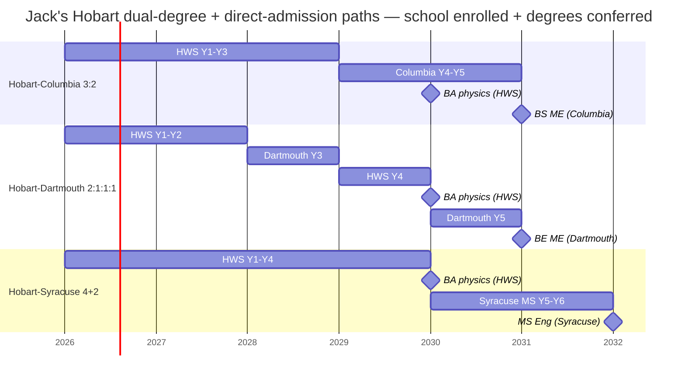

# Semester-by-semester course plans — Hobart variants

*Companion to [`README.md`](./README.md) and [`hobart.md`](./hobart.md). This file maps every term from matriculation to graduation for Jack's **two Hobart dual-degree paths** (2a Columbia, 2b Dartmouth). The Syracuse 4+2 (2e) is graduate-only — Y1–Y4 at Hobart is the [path-agnostic core + a 4th BA-completion year](#hws-y4-senior-year-finish-the-physics-ba), and the Syracuse MS (Y5–Y6) is direct-admission graduate coursework rather than an articulated Hobart-credit-back undergraduate sequence. Representative courses only — specific IDs and term placements are subject to each school's flight plan, advisor approval, and year-specific catalogue updates. WashU 3:3 and RPI 3:2 were **closed** per Spector's 2026-04-24 email confirming neither partnership exists — see [`hobart-unconfirmed-paths.md`](./hobart-unconfirmed-paths.md) for the closed-path archive.*

**Companion files:**

- [`ap-credits.md`](./ap-credits.md) — completed AP scores, May 2026 exam schedule, per-school credit mapping, place-out summaries, Dartmouth FAQ.
- [`wpi-plan.md`](./wpi-plan.md) — Option 1 (WPI direct matriculation) term-by-term plan.
- [`hobart-electives.md`](./hobart-electives.md) — HWS goal-course and free-elective menu with RateMyProfessors sentiment.

---

## The Hobart paths at a glance

| Path                           | Years | Total courses (approx)                 | Degree(s) earned                                  |
| ------------------------------ | ----- | -------------------------------------- | ------------------------------------------------- |
| 2a. Hobart → Columbia 3:2      | 5     | ~24 HWS + ~20 Columbia                 | BA physics (HWS) + BS ME (Columbia SEAS, ABET)    |
| 2b. Hobart → Dartmouth 2:1:1:1 | 5     | ~16 HWS + ~18 Dartmouth (3+3 quarters) | BA physics (HWS) + BE ME (Dartmouth Thayer, ABET) |
| 2e. Hobart → Syracuse 4+2      | 6     | 32 HWS + ~10 Syracuse grad             | BA physics (HWS) + MS Eng (Syracuse ECS, no ABET BS) |

**Y1 + Fall Y2 are path-agnostic.** Jack does not need to pick a fork before **sophomore February** (the Dartmouth application deadline is Feb 1 of Y2). The Columbia application happens in junior year. The Syracuse application happens senior year (Y4) — direct-admission at 3.2 Hobart GPA. Until Spring Y2 all three paths share a single schedule — see the [path-agnostic Hobart Y1–Y2 core](#hobart-y1y2--path-agnostic-core-used-by-2a-and-2b) below.

**Syracuse 4+2 (2e) shares Y1–Y4 with the other 4-yr-at-Hobart paths (2f Cal State, 2g OCS).** The Syracuse / Cal State / OCS-MS years are graduate-level (Syracuse, OCS post-service) or transfer-undergrad (Cal State) and are not articulated Hobart-credit-back sequences — they're separate degree programs that begin after the Hobart BA is conferred. The Syracuse MS coursework is therefore not modeled term-by-term in this file; see [`background.md` §3j](./background.md#3j-syracuse-university-via-42-pathway--confirmed-partnership-ms-only) for the structure.

---

## Non-AP prior learning — McCallie MAT540 Multivariable Calculus (Dr. Shu Sun)

Jack completed MAT540 Multivariable Calculus at McCallie with Dr. Shu Sun. **Decision: Jack takes MATH 232 at HWS as planned.**

Why: MAT540 was a McCallie-only course, not dual-enrolled with a partner college. HWS credit-by-exam is limited to AP / CLEP / IB (no CLEP for multivariable), and transfer / DE credit both require an official college transcript which doesn't exist. The only remaining mechanism is **placement without credit**, which doesn't save a course slot (Jack still needs 32 HWS courses to graduate) and creates prereq-review risk at both dual-degree partners (Columbia Combined Plan, Dartmouth Thayer) — each evaluator would need a custom chair's letter arguing that a non-transcripted course satisfies a Multivariable prereq. Not worth the risk to the dual-degree pipeline.

Net effect: MAT540 gives Jack a running start (he's seen the material and can aim for a clean A in MATH 232 Fall Y1), but does not shift any course slots in the plan.

---

## Hobart Y1–Y2 — path-agnostic core (used by 2a and 2b)

**Single source of truth for Jack's first 4 semesters.** Identical course layout for both Hobart dual-degree paths (and matches the Y1–Y2 layout for 2e/2f/2g paths that stay at Hobart 4 years). Optimized for: (a) getting every partner-school STEM prereq into the transcript before Thayer's Feb 1 Y2 deadline, (b) minimum writing load (1 FSEM total, low-writing goal picks everywhere else), (c) maximum easy-A sentiment per [`hobart-electives.md`](./hobart-electives.md), and (d) front-loading 3 aspirational goals so Y3 / Y4 have flexibility.

| Term          | Courses                                                                                                                                                      | Notes                                                                                                                                                                                                                                                                                                                                   |
| ------------- | ------------------------------------------------------------------------------------------------------------------------------------------------------------ | --------------------------------------------------------------------------------------------------------------------------------------------------------------------------------------------------------------------------------------------------------------------------------------------------------------------------------------- |
| **Fall Y1**   | <ul><li>**FSEM** (writing-intensive First-Year Seminar)</li><li>**PHYS 150** Intro Physics I</li><li>**MATH 232** Multivariable Calc</li><li>**MUS 930 Chorale** (½ cr, Goal #1 — Partial AP)</li></ul> | FYS likely satisfies Columbia's University Writing via Course Equivalence Form. PHYS 150 lab-heavy. Chorale is the 0-writing ensemble re-entry (see [Recommended goal-course picks](#recommended-goal-course-picks--y1y2)). MATH 232 is a re-take of McCallie MAT540 material (see [Non-AP prior learning](#non-ap-prior-learning--mccallie-mat540-multivariable-calculus-dr-shu-sun)). |
| **Spring Y1** | <ul><li>**PHYS 160** Intro Physics II</li><li>**MATH 204** Linear Algebra</li><li>**CHEM 110** Gen Chem + lab</li><li>**ECON 160** Principles of Economics</li><li>**MUS 930 Chorale** (½ cr add-on, pairs with Fall Y1)</li></ul> | ECON 160 satisfies Columbia's ECON W1105 prereq. Per the HWS Educational Goals database it carries only **Partial Quantitative Reasoning** (already covered by the physics major) — so it functions as a free elective toward the 4 courses/semester, **not** a goal course. The 2nd Chorale semester pairs with Fall Y1 to = 1 Partial-AP course-equivalent (Chorale is ½-credit and co-curricular to the 4 academic courses). Linear Algebra is a Dartmouth must-have. |
| **Fall Y2**   | <ul><li>**PHYS 270** Modern Physics</li><li>**MATH 237** Diff Eq</li><li>**CPSC 225** Data Structures (post-AP CS)</li><li>**ANTH 110** Intro Cultural Anthropology (Goal #2 — double-count: Substantial SI + Substantial CD)</li></ul> | Diff Eq is Columbia required. CPSC 225 upgrades Jack's CS footprint for ME software-heavy work. ANTH 110 in 1 course closes 2 of the 4 live goals (SI + CD); target Maiale's section per RMP. |
| **Spring Y2** | <ul><li>**PHYS 285** Electromagnetic Theory</li><li>**Physics elective #1**</li><li>**DAN 110** Dances of the African Diaspora (Goal #3 — Substantial AP, 0 writing)</li><li>**Free elective OR 2nd chem**</li></ul> | **⚠ Dartmouth 2b application deadline is Feb 1 of Y2.** Jack decides before this term whether 2b is in play — if yes, ensure the Y1–Y2 transcript has all 7 Thayer prereqs done. DAN 110 closes AP substantively (Fall Y1 ensemble becomes insurance). A second chem course is NOT required for any partner; use slot for ME-useful elective (e.g., CPSC 229 Computer Organization). |

### Running goal / writing load across Y1–Y2

- **Writing-intensive courses:** 1 (the FSEM). Every other course — STEM prereqs, ECON 160, goal courses — is picked for zero or short-paper writing load.
- **Goal courses closed by end of Y2:** 3 live goals (AP via MUS 930, SI + CD via ANTH 110, and — with DAN 110 in Spring Y2 — AP substantively again). After Spring Y2 only EJ remains live (covered by PHIL 163 in Y3).
- **Physics-major auto-coverage:** MATH + PHYS courses auto-cover Quantitative Reasoning + Scientific Inquiry goals.
- **Rowing / PE:** **HWS has no PE graduation requirement** (2024–25 catalogue, pp. 7–10 — 32 academic courses + FYS + major + goals only). PER 973 Rowing is listed explicitly as a no-credit course. Practical effect: Jack's 4 academic courses/semester stay 100% academic — rowing is pure extracurricular, neither earning nor consuming any of his 24 course slots.

### Rationale for this specific Y1–Y2 layout

1. **Thayer prereq coverage is complete by end of Spring Y2.** Calc III (MATH 232 F1), Linear Algebra (MATH 204 S1), Physics I (PHYS 150 F1), Physics II (PHYS 160 S1), Gen Chem (CHEM 110 S1), CS (AP + CPSC 225 F2), Diff Eq (MATH 237 F2). All 7 Thayer prereqs done before the Feb 1 Y2 application.
2. **Columbia prereq coverage is also complete.** Same STEM stack plus ECON 160 (covers ECON W1105) in S1.
3. **3 of 4 live aspirational goals close by end of Y2**, so Y3 (2a) or Y4 (2b) only needs to handle the 4th (EJ via PHIL 163) — lots of flexibility.

### Recommended goal-course picks — Y1–Y2

Full menu + RMP sentiment in [`hobart-electives.md`](./hobart-electives.md). Summary for Y1–Y2 slots only:

| Goal slot | Term     | Recommended course                                       | Closes which goal(s)                             | Writing | Why this pick |
| --------- | -------- | -------------------------------------------------------- | ------------------------------------------------ | ------- | ------------- |
| #1        | Y1 full year | **MUS 930 Chorale** × 2 semesters (½ cr each) | Partial AP × 2 = 1 AP course-equivalent            | 0       | Ensemble = participation grade. Gentlest music re-entry given Jack's ~3-year gap. |
| #2        | Fall Y2  | **ANTH 110 Intro Cultural Anthropology** (Maiale)        | Substantial SI + Substantial CD (double-count)    | 2–3 short papers | Maiale's section 2.0/5 difficulty RMP: "common-sense quizzes, clear study guide." |
| #3        | Spring Y2 | **DAN 110 Dances of the African Diaspora**              | Substantial AP (substantive closure)              | 0       | Studio-based, no writing. Fall Y1 ensembles stay insurance. |

**Total Y1–Y2 writing:** 1 FSEM + 2–3 ANTH 110 short papers = very light. No long research essays.

---

## Hobart Y3 — used by 2a only (2b is at Dartmouth in Y3)

Path 2a (Columbia) stays at Hobart through Y3 before transferring to Columbia. Path 2b (Dartmouth) leaves for Dartmouth in Y3 and returns for Y4 — see [Path 2b → HWS Y4](#hws-y4-senior-year-finish-the-physics-ba) below. The 4-year-at-Hobart paths (2e Syracuse, 2f Cal State, 2g OCS) follow this Y3 layout too, plus the Y4 layout that Path 2b uses on its return.

| Term          | Courses                                                                                                                                                      | Notes                                                                                                                                                                                                                                                                                                                                   |
| ------------- | ------------------------------------------------------------------------------------------------------------------------------------------------------------ | --------------------------------------------------------------------------------------------------------------------------------------------------------------------------------------------------------------------------------------------------------------------------------------------------------------------------------------- |
| **Fall Y3**   | <ul><li>**PHYS 383** Quantum Mechanics</li><li>**Physics elective #2**</li><li>**PHIL 163** Philosophy of Sport (Goal #4 — Substantial EJ)</li><li>**Free elective**</li></ul> | Finalize BA, apply to Columbia (Feb Y3 deadline). Target a Frost-Arnold PHIL 163 section if available (2.3/5 diff RMP). |
| **Spring Y3** | <ul><li>**PHYS capstone / senior project**</li><li>**Physics elective #3**</li><li>**Goal #5 buffer** (e.g., **MUS 110** Music Theory w/ Lofthouse, or **THTR 160** Stagecraft)</li><li>**Free elective**</li></ul> | Complete HWS physics BA + 5th aspirational goal course. All 4 live goals already closed by end of Fall Y3 (SI+CD via ANTH 110 Y2, AP via DAN 110 Y2, EJ via PHIL 163 Y3); this slot is optional depth / easy-A buffer. Transfer to Columbia in Fall Y4 (or stay at Hobart for Y4 if Columbia rejects — 4-yr-at-Hobart paths 2e/2f/2g use the same Y3 layout). |

### Recommended goal-course picks — Y3

| Goal slot | Term     | Recommended course                                       | Closes which goal(s)                             | Writing | Why this pick |
| --------- | -------- | -------------------------------------------------------- | ------------------------------------------------ | ------- | ------------- |
| #4        | Fall Y3  | **PHIL 163 Philosophy of Sport** (Frost-Arnold)         | Substantial EJ                                   | 2–3 short papers | Substantive for a varsity rower (literal sports ethics). Low RMP difficulty. |
| #5 (optional buffer) | Spring Y3 | **MUS 110 Intro Music Theory** (Lofthouse) | (all 4 live goals already closed)              | 0–low   | Lofthouse 1.6/5 RMP — strongest easy-A signal on the HWS roster. |

**Minimum goal courses needed:** 3 (ANTH 110 + DAN 110 + PHIL 163). Fall Y1 ensembles and Spring Y3 buffer are optional. If Jack wants to reclaim the Spring Y3 slot, he can — the 3 goal courses above plus the 2 physics-major goal contributions already satisfy the 5-distinct-courses rule.

---

## ⚠ Items to confirm before matriculation

Per Spector's 2026-04-24 email handoff, these now route to **Prof. Ileana Dumitriu** (engineering liaison, `dumitriu@hws.edu`) for items 2–3, and to **Prof. Ted Allen** (physics dept chair, `allen@hws.edu`) for item 1's physics-major side. AP-specific items (physics exemption via the August placement meeting with Prof. Allen, Calc BC count, 7-course AP cap) live in [`ap-credits.md`](./ap-credits.md#-items-to-confirm-about-ap-credit). Non-AP items below:

1. **Physics major auto-covers QR + Scientific Inquiry goals** (→ Prof. Allen) — verify MATH 130/131 and PHYS 150/160 (or whichever major courses Jack takes) currently carry the Quant Reasoning and Scientific Inquiry attributes in PeopleSoft. If a gap exists, Jack would need one of the free-elective Quant/SInq picks to close it. (Tracked as [`hobart-questions.md` §1b.2](./hobart-questions.md#1b-prof-ted-allen--hws-physics-department-chair).)
2. **FSEM → Columbia University Writing equivalency** (→ Prof. Dumitriu) via Combined Plan Course Equivalence Form. If denied, Jack takes a 100-level rhetoric course (WRRH 100) for Columbia only — adds 1 non-STEM course in Path 2a. (Tracked as [`hobart-questions.md` §1.6](./hobart-questions.md#1-prof-ileana-dumitriu--hws-engineering-liaison).)
3. **Term offerings + goal attributes for Jack's recommended picks** (→ Jack's assigned academic advisor, per registration window) — re-verify at each registration window that **ANTH 110, DAN 110, PHIL 163**, and the Y1–Y2 Chorale (MUS 930) are (a) actually offered in the proposed semester per [HWS Course Search](https://www.hws.edu/academics/course-search.aspx), (b) still carry the listed goal attribute in PeopleSoft, and (c) are being taught by the instructor whose RMP sentiment informed the easy-A pick (Maiale for ANTH 110, Frost-Arnold for PHIL 163, Lofthouse for the MUS 110 buffer). If any gate fails, fall back to the substitutions in [`hobart-electives.md`](./hobart-electives.md).

**⚠ Before locking each term's registration:** not every HWS course runs every semester. Check the [HWS Course Search](https://www.hws.edu/academics/course-search.aspx) for term offerings and re-verify goal attributes in PeopleSoft. The semester assignments above assume all recommended courses are offered in the indicated term — if ANTH 110 isn't running Fall Y2, the whole sequence shifts. Have Jack's assigned academic advisor (or Prof. Dumitriu for engineering-specific routing) review the final sequence at each registration window.

---

## Path 2a — Hobart → Columbia SEAS ME BS (3:2, 5 years)

**Y1–Y3 at Hobart:** [path-agnostic Y1–Y2](#hobart-y1y2--path-agnostic-core-used-by-2a-and-2b) + [Y3 table](#hobart-y3--used-by-2a-only-2b-is-at-dartmouth-in-y3) above.

**Y4–Y5 at Columbia** (standard semesters, 4–5 courses per term, ~9 courses/year, ~18 courses total at Columbia).

**Columbia ME prereqs satisfied at Hobart:** Calc I–III (AP + MATH 232), Linear Algebra (MATH 204), Diff Eq (MATH 237), Physics I–II (PHYS 150 + 160), Gen Chem + lab (CHEM 110), CS (AP + CPSC 225), Econ (ECON 160), University Writing (FSEM, pending equivalence). All 27 non-technical credits satisfied by the HWS BA structure (physics major + 5 goal courses + FSEM + electives).

| Term          | Representative courses | Bucket            | Notes                                                           |
| ------------- | ---------------------- | ----------------- | --------------------------------------------------------------- |
| **Fall Y4**   | <ul><li>**MECE E3301** Mechanics of Fluids</li><li>**MECE E3100** Mechanics of Solids</li><li>**APMA E3101** Applied Math I</li><li>**MECE E3420** Heat Transfer</li><li>**Nontech elective #1**</li></ul> | 4 ME/STEM · 1 HUM | First Columbia term. First rowing season on Columbia LW. |
| **Spring Y4** | <ul><li>**MECE E3311** Thermodynamics</li><li>**MECE E3610** Electromechanical Systems Lab</li><li>**MECE E4614** Machine Element Design</li><li>**ME elective #1**</li><li>**Nontech elective #2**</li></ul> | 4 ME/STEM · 1 HUM | Heaviest term. |
| **Fall Y5**   | <ul><li>**MECE E4100** Mech Eng Senior Design I</li><li>**MECE E4520** Data Science for Mech Engrs</li><li>**ME elective #2**</li><li>**ME elective #3**</li><li>**Nontech elective #3**</li></ul> | 4 ME/STEM · 1 HUM | Y5 Jack is a graduate-standing student — Ivy rowing ineligible. |
| **Spring Y5** | <ul><li>**MECE E4101** Senior Design II (capstone)</li><li>**ME elective #4**</li><li>**ME elective #5**</li><li>**Nontech elective #4**</li></ul> | 3 ME/STEM · 1 HUM | Capstone graduation term. |

**Non-STEM load at Columbia:** 3–4 nontech electives across Y4–Y5 (assuming Combined Plan students follow the 27-pt nontech rule without the Columbia Core humanities requirement — see flag below). Zero writing-intensive requirement if Jack picks problem-set-style nontech electives.

### Columbia Y4–Y5 low-writing nontech picks

Columbia's [approved nontech elective list](https://bulletin.engineering.columbia.edu/b-elective-nontechnical-courses) is deep. Prefer:

- **ECON W3211 Intermediate Microeconomics** · **ECON W3213 Intermediate Macroeconomics** — problem sets, minimal writing; Jack already has ECON 1105 from HWS.
- **COMS W3203 Discrete Math** — if approved as nontech for ME; pure problem sets.
- **HIST W3930 History of Technology** or **HIST W3925 Science in American History** — reading-heavy but short response papers.
- **MUSI V3321 Music Theory I** — notation and ear-training, not essay-based.
- **PSYC W1010 Mind, Brain, Behavior** — intro cog-sci, exam-based.

**Avoid** Columbia Core Curriculum courses (Lit Hum, Contemporary Civilization, Art Hum, University Writing) unless explicitly required — these are the writing-heaviest courses on campus. Combined Plan students are believed to be exempt from the full Core; see confirm box.

### ⚠ Items to confirm with Columbia Combined Plan office

1. **27-pt nontech waiver** — the ME bulletin footnote suggests Combined Plan students may have a reduced/waived nontech requirement vs. direct SEAS admits. Clarify the exact nontech count required at Columbia Y4–Y5 for a 3:2 entrant who already has a full HWS BA.
2. **Course Equivalence Form submissions** — walk through HWS ECON 160, FSEM, and the STEM prereqs with the Combined Plan adviser to ensure each is mapped on Jack's file before he matriculates.
3. **Columbia AP forfeiture rules** — confirm Jack's HWS-transcribed calc/physics do NOT trigger the "credit forfeited if PHYS UN1401/1601 taken" rule. (They shouldn't, because he took them at HWS, not Columbia — but worth confirming.)
4. **ME electives picked for low writing** — ME 4000-level electives are all technical; but confirm with an ME adviser which specific electives have the lowest lab-report burden (heat transfer labs tend to be report-heavy; theory-only electives less so).

---

## Path 2b — Hobart → Dartmouth Thayer ME BE (2:1:1:1, 5 years)

**Y1–Y2 at Hobart:** identical to the [path-agnostic Y1–Y2 core](#hobart-y1y2--path-agnostic-core-used-by-2a-and-2b) above — no duplication here. By end of Spring Y2, Jack has all 7 Thayer prereqs on his transcript (Calc III, Linear Algebra, Diff Eq, Physics I, Physics II, Gen Chem, CS) plus 3 of 4 live goals closed (AP via Chorale, SI+CD via ANTH 110, AP via DAN 110).

**Application timing:** **Feb 1 of Y2 is the hard Dartmouth application deadline.** Decision by ~April. Jack submits during Spring Y2 while finishing PHYS 285 + DAN 110.

**Dartmouth calendar:** 3 quarters per academic year (Fall, Winter, Spring), **3 courses per quarter typically.** Y3 = 9 courses at Dartmouth; Y5 = 9 courses at Dartmouth. Total = 18 Dartmouth courses.

### Dartmouth Y3 (junior year at Thayer)

Thayer's ME-track Y3 is 3 engineering courses per quarter (the Thayer sequence) plus room for ~3 non-engineering courses spread across the 3 quarters. **Dartmouth explicitly structures Y3 so the non-ENGS slots count back toward the home-school BA** — this is the mechanism by which 2b absorbs some HWS-side work at Dartmouth.

| Quarter       | Courses | Bucket                     | Notes                                                                             |
| ------------- | ------- | -------------------------- | --------------------------------------------------------------------------------- |
| **Fall Y3**   | <ul><li>**ENGS 21** Intro to Engineering</li><li>**ENGS 22** Systems</li><li>**Non-ENGS #1** (Math elective, e.g., MATH 23 Diff Eq II or Probability)</li></ul> | 2 ENGS · 1 non-ENGS (STEM) | Rowing season = Dartmouth LW (only Ivy LW season in this path). |
| **Winter Y3** | <ul><li>**ENGS 23** Distributed Systems and Fields</li><li>**ENGS 33** Solid Mechanics (ME)</li><li>**Non-ENGS #2** (PHYS elective or ECON elective)</li></ul> | 2 ENGS · 1 non-ENGS (STEM) | ENGS 33 is a core ME concentration course. |
| **Spring Y3** | <ul><li>**ENGS 34** Fluid Mechanics (ME)</li><li>**ENGS 25** Modeling & Design</li><li>**Non-ENGS #3** (COSC elective or additional MATH)</li></ul> | 2 ENGS · 1 non-ENGS (STEM) | ENGS 34 requires ENGS 23. 3 non-ENGS slots all STEM-adjacent = zero writing load. |

**Non-ENGS slots transfer:** Up to 3 courses from Y3 Dartmouth transfer back to HWS toward free-elective buffer (the 4 live HWS aspirational goals are already closed by end of Fall Y3 HWS-side via DAN 110 Spring Y2 + PHIL 163 deferred to Y4).

### HWS Y4 (senior year, finish the physics BA)

| Term          | Courses | Notes |
| ------------- | ------- | ----- |
| **Fall Y4**   | <ul><li>**PHYS 383** Quantum Mechanics</li><li>**Physics elective #2**</li><li>**PHIL 163** Philosophy of Sport (Goal #4 — Substantial EJ, deferred from shared Y3)</li><li>**Free elective**</li></ul> | Final year of HWS rowing (openweight, burns 4th/final IRA season). PHIL 163 closes the last live goal. |
| **Spring Y4** | <ul><li>**PHYS capstone / senior project**</li><li>**Physics elective #3**</li><li>**Goal #5 buffer** (e.g., **MUS 110** Music Theory w/ Lofthouse, or **THTR 160** Stagecraft)</li><li>**Free elective**</li></ul> | Completes HWS physics BA. BA conferred at end of Y4 (may defer to Y5 alongside BE). |

### Dartmouth Y5 (BE year)

The BE year is pure engineering: 3 quarters × 3 courses = 9 courses. Thayer BE structure: ENGS 89–90 ME capstone (2 terms), ENGS 91–93 Applied Math sequence (3 terms, 1 per quarter), plus ~4 ME concentration / design electives.

| Quarter       | Courses | Bucket | Notes                                         |
| ------------- | ------- | ------ | --------------------------------------------- |
| **Fall Y5**   | <ul><li>**ENGS 89** Engineering Design Methodology (capstone I)</li><li>**ENGS 91** Numerical Methods</li><li>**ENGS 76** Machine Engineering (ME concentration)</li></ul> | 3 STEM | Y5 graduate standing = Ivy rowing ineligible. |
| **Winter Y5** | <ul><li>**ENGS 90** Engineering Design Project (capstone II)</li><li>**ENGS 92** Fourier + Complex Analysis</li><li>**ENGS 71** Structural Analysis</li></ul> | 3 STEM | |
| **Spring Y5** | <ul><li>**ENGS 93** Statistical Methods</li><li>**ENGS 75** Product Design + Manufacturing</li><li>**ME elective**</li></ul> | 3 STEM | BE conferred at end of Y5. |

### Y3 Dartmouth low-writing non-ENGS picks

- **MATH 23 Differential Equations II** — problem sets only.
- **MATH 20 Probability** · **MATH 50 Linear Algebra II** — pure math, no writing.
- **PHYS 50 Methods of Theoretical Physics** — extension of HWS physics.
- **ECON 1 / 2 / 10 Principles / Micro / Macro** — problem sets + exams.
- **COSC 10 / 30 / 50** — CS electives, lab-based.

### Y5 Dartmouth ME concentration elective picks

Thayer requires 3–4 courses forming a "concentration." ME-track options (low writing, problem-set / project based):

- **ENGS 71 Structural Analysis** (solids track)
- **ENGS 76 Machine Engineering** (design track)
- **ENGS 75 Product Design + Manufacturing** (design track)
- **ENGS 168 Optimization**
- **ENGS 147 Advanced Heat Transfer**

### ⚠ Items to confirm with Dartmouth Thayer + Prof. Dumitriu

1. **AP credit treatment for prereqs** — Thayer's dual-degree page says home-institution AP/IB is honored, but earlier guidance said AP/IB do not count toward prereqs. Clarify: do Jack's AP-transcribed Calc + CS count, or does he need to retake at HWS for a letter grade? **If the latter, Y1–Y2 at HWS shifts significantly** (CPSC 225 moves to CPSC 124 actually taken, additional math slot needed).
2. **Non-ENGS Y3 course attribute transfer** — confirm with Thayer registrar AND Prof. Dumitriu (engineering liaison) that MATH 23, PHYS 50, ECON 1, etc. taken at Dartmouth carry HWS goal attributes when transferred back. The 2:1:1:1 cost advantage and the "Y3 absorbs goal courses" narrative both depend on this.
3. **Y5 writing requirement** — Dartmouth undergrads have a Writing 5 requirement. Dual-degree BE students typically don't take it (they satisfy writing via home-school FSEM). Confirm this still holds for Thayer 2:1:1:1 students in the current handbook.
4. **ME-track-specific ENGS 24–28 and ENGS 30–37 picks** — the Thayer ME concentration has a specific subset of required + recommended electives; get the current ME track sheet from Thayer academic advising.

See also the [Dartmouth FAQ in `ap-credits.md`](./ap-credits.md#faq-for-the-hobart--dartmouth-21-1-1-path) for the "does Dartmouth require Physics 1 & 2 / accept US History?" answers.

---

## Consolidated low-writing elective picks (Hobart paths)

Summary table across the 2 Hobart dual-degree paths, grouped by school. For the WPI-side picks, see [`wpi-plan.md`](./wpi-plan.md#wpi-electives--low-writing-picks). For the closed-path archive's WashU 3:3 elective picks (not a live option per Spector 2026-04-24), see [`hobart-unconfirmed-paths.md`](./hobart-unconfirmed-paths.md).

| School                            | Where the slack is                                  | Top picks (low writing, high STEM-adjacency)                                                                                                                                                                                      |
| --------------------------------- | --------------------------------------------------- | --------------------------------------------------------------------------------------------------------------------------------------------------------------------------------------------------------------------------------- |
| **HWS** (all Hobart paths)        | 5 aspirational goal courses + free electives        | **ANTH 110** (Substantial SI + CD double-count) · **DAN 110** (Substantial AP + CD double-count) · **PHIL 163 Philosophy of Sport** (Substantial EJ) · Music ensembles (Partial AP, 0 writing) · ECON 160 and MUS 110 as free-elective fillers (neither carries a live-goal attribute) — see [recommended goal-course picks](#recommended-goal-course-picks--y1y2) and [`hobart-electives.md`](./hobart-electives.md) for the full menu + RMP sentiment |
| **Columbia Y4–Y5**                | ~4 nontech electives (if not waived) + ME electives | ECON W3211 / W3213 · HIST W3930 History of Tech · MUSI V3321 Music Theory · PSYC W1010 Cog Sci · **avoid Core courses**                                                                                                           |
| **Dartmouth Y3 non-ENGS**         | 3 courses                                           | MATH 23 Diff Eq II · MATH 20 Probability · PHYS 50 Theoretical Methods · ECON 1 / 10 · COSC 30 (all pure STEM, no writing)                                                                                                        |
| **Dartmouth Y5 BE concentration** | 3–4 ME concentration electives                      | ENGS 71 Structural Analysis · ENGS 76 Machine Eng · ENGS 75 Product Design · ENGS 168 Optimization                                                                                                                                |

**Writing-heavy courses Jack should actively avoid** (where optional):

- HWS WRRH 100 rhetoric courses (only take if FSEM advisor requires)
- Columbia Core (Lit Hum, Contemporary Civilization, University Writing, Art Hum) — likely waived for Combined Plan
- Dartmouth Writing 5 — dual-degree BE students typically exempt; confirm
- Any "Seminar in X" course at any school where "seminar" implies weekly papers

---

## How to use this document

1. **Read your path's section.** Each path section (2a / 2b) references the shared Hobart Y1–Y2 core instead of duplicating, so start there if you want the first two years.
2. **Flag the ⚠ items** — they're the real questions to ask admitted-student advisers / Prof. Dumitriu (engineering) / Prof. Allen (physics placement) before matriculation. AP-specific items live in [`ap-credits.md`](./ap-credits.md).
3. **Adjust electives to taste.** The specific course IDs are representative; schools update flight plans and course catalogs annually. The *bucket structure* (how many STEM / HUM / free slots per semester) is the stable part.
4. **Re-review in mid-July 2026** once Physics C (Mech + E&M) and Microeconomics scores from May 2026 post. The plan assumes Physics C 5/5 — if that holds, the main remaining conversation is the **August 2026 in-person Physics Dept. placement meeting with Prof. Allen (or designated faculty)**. Per Spector's 2026-04-24 reply, the AP score alone doesn't grant PHYS 150/160 exemption — placement is decided at that meeting. If the department exempts Jack, his Y1 gets 2 courses lighter and the rest of the plan decompresses accordingly. If Physics C underperforms, consult [`ap-credits.md`](./ap-credits.md#working-assumption--physics-c-both-score-5-in-may-2026) and [`wpi-plan.md`](./wpi-plan.md) for contingency adjustments.
